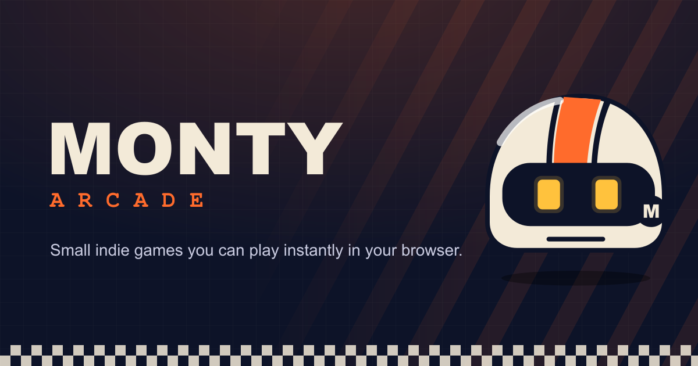
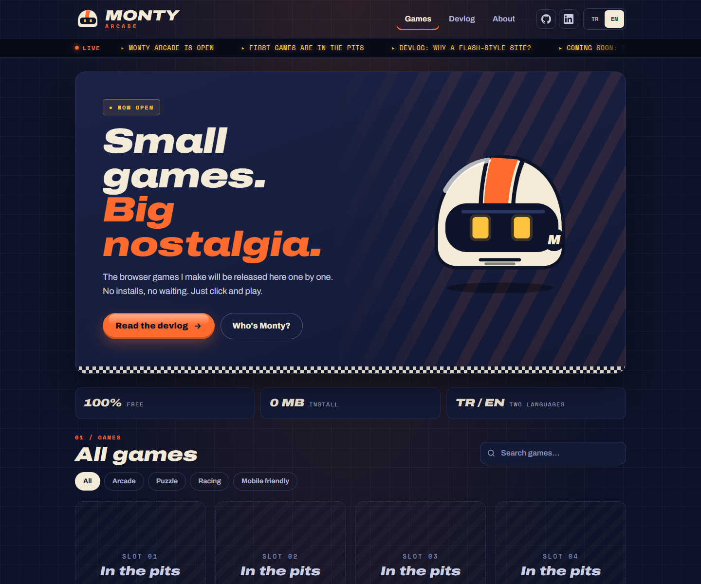
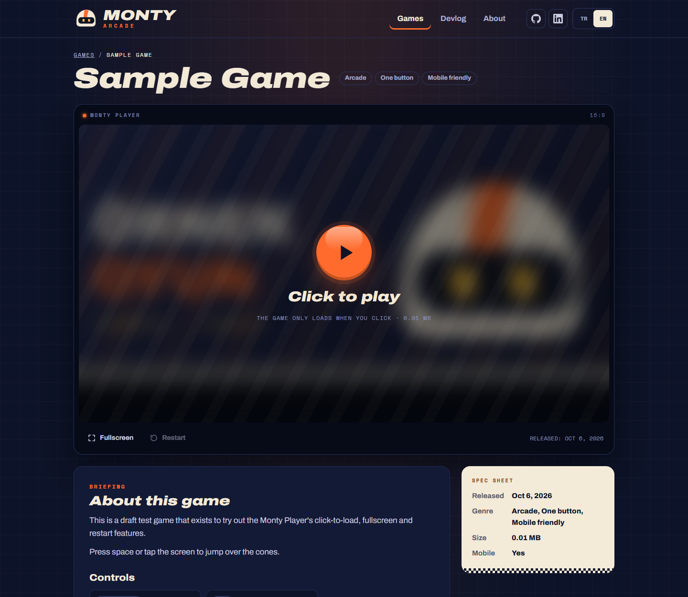
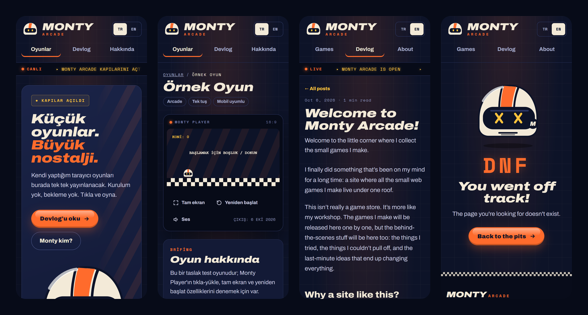

<div align="center">



# Monty Arcade

**Small games. Big nostalgia.**

A home for the small browser games I make, plus a devlog about making them.<br>
The flash game portals of the 2000s, rebuilt for today's web.

[](https://astro.build)
[](https://www.typescriptlang.org)
[](vercel.json)
[](src/i18n/ui.ts)
[](https://developer.chrome.com/docs/lighthouse)

### [▶ Play at monty-arcade.vercel.app](https://monty-arcade.vercel.app)

**English** · [Türkçe](README.tr.md)

</div>

---

## 🏁 About

Monty Arcade is my personal project for learning how to ship a product end to end: designing it, building it,
putting it online, growing it and keeping it running. Not just the fun parts.

I wanted to start from somewhere I know well. The flash game sites where I spent my free time as a kid were
where I first really connected with the internet: no installs, no accounts, click a game and play. Monty Arcade
takes that spirit and pairs it with a modern, fast, mobile-friendly web.

- **Only my own games.** Every game here is something I made.
- **A devlog.** Ideas, dead ends, small wins and what I learned along the way.
- **Monty**, the mascot: an original retro racing helmet with LED eyes. The name comes from *Montgomery*, the real name of a racing legend.

> The first games are getting ready in the pits. 🏎️

## 📸 Screenshots

<p align="center">
  
  
</p>
<p align="center">
  
</p>

<sub>The game page shows a draft sample game used to test the template. Drafts only appear in development.</sub>

## ✨ Features

| | |
|---|---|
| 🎮 **Monty Player** | Click-to-load iframe player with fullscreen and restart. The game is only downloaded when you press play. |
| 🗂️ **Content-driven** | Add a game with three files: the game build, a cover image and a Markdown info file. Grid, filters, ticker, hero and sitemap update automatically. |
| 🔎 **Search & tags** | Instant client-side search across both languages, plus tag filters. |
| 🌍 **TR / EN** | Every page in both languages, browser-language redirect, a language switcher that keeps you on the same page, `hreflang` everywhere. |
| 📰 **Devlog** | Markdown posts with reading time, previous/next links and a related game card. |
| 📺 **Flash-era details** | LED ticker, checkered flags, speed lines, glossy buttons, 88×31 badges and a "DNF" 404 page. All kept subtle. |
| ♿ **Accessible** | Skip link, visible focus, 44 px touch targets, `prefers-reduced-motion`, semantic HTML, screen-reader labels. |
| 🏆 **Ready for v2** | Achievement schema, achievement panel and sign-in slots already built, hidden behind a feature flag. |

## 🧰 Tech stack

- **[Astro 7](https://astro.build)**: static output, content collections, `astro:assets` image pipeline (WebP)
- **TypeScript** (strict), checked with `astro check`
- **Plain CSS** with design tokens as custom properties. No UI framework.
- **Vanilla JS** only where needed (filter/search, player, language memory): about 3 KB on the home page
- **Self-hosted fonts** via Fontsource: Archivo (variable, `wdth` + `wght`) and Space Mono
- **@astrojs/sitemap**, plus `robots.txt` and Open Graph tags generated from one config file

## 🚀 Getting started

Requires **Node.js 22.18+** (developed on Node 24).

```bash
git clone https://github.com/ardahanaytan/Monty-Arcade.git
cd Monty-Arcade
npm install
npm run dev
```

| Command | What it does |
|---|---|
| `npm run dev` | Dev server at `http://localhost:2705`. Draft content is visible here. |
| `npm run build` | Production build to `dist/`. Drafts are excluded. |
| `npm run preview` | Serves `dist/` at `http://localhost:2607` |
| `npm run check` | Type-checks the project (`astro check`) |
| `npm run og` | Regenerates the social share image `public/og-default.png` |

## 🗺️ Project structure

```text
src/
├─ config/site.ts          site name, links, feature flags (most settings live here)
├─ i18n/ui.ts              every UI string (TR/EN) and tag labels
├─ content.config.ts       content schemas: games, devlog
├─ content/
│  ├─ games/<slug>.md      game info files (+ covers/)
│  └─ devlog/{tr,en}/      devlog posts
├─ components/             Header, Ticker, GameGrid, GameCard, Player, MontyHelmet…
├─ layouts/                Base (page shell), Prose (long-form text)
├─ pages/                  /, /[lang]/, /[lang]/games/[slug]/, /[lang]/devlog/…, /[lang]/about/, 404
└─ styles/                 tokens.css, global.css, fonts.css
public/
└─ play/<slug>/            game builds, served in an iframe
```

## 🕹️ Adding a game

1. Put the game's build in `public/play/<slug>/`. The entry file must be `index.html`, and the game must use relative paths.
2. Add a cover: `src/content/games/covers/<slug>.png` (16:10, at least 1280×800; converted to WebP automatically).
3. Create `src/content/games/<slug>.md`:

```yaml
---
title: { tr: "Örnek Oyun", en: "Sample Game" }
tagline: { tr: "Tek cümlelik açıklama.", en: "One-line description." }
description:
  tr: "İlk paragraf.\n\nİkinci paragraf."
  en: "First paragraph.\n\nSecond paragraph."
controls:
  - keys: ["←", "→"]
    action: { tr: "Hareket", en: "Move" }
cover: ./covers/sample-game.png
tags: [arcade, one-button, mobile]
releaseDate: 2026-11-01
featured: true       # "Game of the week" on the home page
sizeMB: 2.4
mobile: true
---
```

That's it. The game card, tag filters, LED ticker, "NEW" badge (30 days), game page, "More games",
home hero and sitemap all update on the next build. A game can read its language from the `?lang=tr|en` URL parameter.

<details>
<summary><b>All game fields</b></summary>

| Field | Type | Notes |
|---|---|---|
| `title`, `tagline`, `description` | `{ tr, en }` | `description` paragraphs are separated by `\n\n` |
| `controls` | list of `{ keys, action }` | Rendered as keyboard keys |
| `cover` | image | 16:10, ≥ 1280×800 |
| `tags` | string list | Labels in `src/i18n/ui.ts` → `tagLabels` |
| `releaseDate` | date | Controls sort order and the "NEW" badge |
| `featured` | boolean | Hero game (otherwise the newest game) |
| `aspectRatio` | string | Player ratio, default `16/9` |
| `sizeMB`, `mobile` | number, boolean | Shown in the spec sheet |
| `playUrl` | string | Default `/play/<slug>/index.html` |
| `relatedPosts` | string list | Devlog slugs (or set `game: <slug>` in a post) |
| `achievements` | list | Ready for v1.5/v2: `id`, `title`, `description`, `icon`, `tier`, `hidden` |
| `draft` | boolean | Visible only in `npm run dev`; files are stripped from `dist/` |

</details>

## ✍️ Writing a devlog post

Create `src/content/devlog/tr/<slug>.md` and/or `src/content/devlog/en/<slug>.md`. Use the **same slug** for
both languages so the language switcher can pair them. A post that exists in only one language falls back to the
other language's devlog list.

```yaml
---
title: "Post title"
description: "Short summary shown in the list."
date: 2026-10-06
game: sample-game    # optional: shows the game's card at the end
---
```

## 🌍 Internationalization

- Routes live under `/tr/…` and `/en/…`. The root `/` redirects based on browser language and remembers your last choice.
- Every user-facing string comes from `src/i18n/ui.ts`. Components contain no hard-coded text.
- Turkish casing uses `toLocaleUpperCase('tr')` (i → İ).
- The 404 page contains both languages and shows the right one based on the URL prefix or the browser language.

## 🎨 Design system

"Modern retro racing / arcade": a night-race track feel. Deep navy, cream text, **one** accent colour.

| Token | Value | Use |
|---|---|---|
| `--bg` | `#0d1328` | Page background |
| `--surface` | `#131a36` | Cards, panels |
| `--text` | `#f3ead8` | Cream text and headings |
| `--accent` | `#ff6b2c` | Racing orange, the single accent |
| `--led` | `#ffc23d` | LED yellow: ticker, Monty's eyes, links |

**Typography:** Archivo (125% width, italic, weight 900) for display headings; Space Mono for labels.
All tokens are in [`src/styles/tokens.css`](src/styles/tokens.css). Changing `--accent` recolours the whole site.

## ⚙️ Configuration

Most settings live in [`src/config/site.ts`](src/config/site.ts):

```ts
export const site = {
  name: 'Monty Arcade',
  url: 'https://monty-arcade.vercel.app',   // canonical, hreflang, sitemap and robots are generated from this
  links: { github, linkedin, itch, kofi, email },   // empty links are hidden
  features: {
    accounts: false,            // v2: sign-in, achievements panel, badge counts
    achievementsTeaser: true,   // "Coming soon: profiles & achievements" box
  },
  newBadgeDays: 30,
};
```

## ☁️ Deployment

The output is fully static (`dist/`). Build command `npm run build`, output directory `dist`.

- **Vercel:** cache headers come from [`vercel.json`](vercel.json).
- **Cloudflare Pages:** cache headers come from [`public/_headers`](public/_headers).

Hashed assets are cached for a year (`immutable`), game files for a day with `stale-while-revalidate`.

## ⚡ Performance

- Visitors download only the game they open. The iframe is created on click, never on page load.
- CSS is inlined per page (about 20 KB), so there are no render-blocking stylesheet requests.
- Fonts are self-hosted and preloaded. Turkish letters (Ğ ğ İ ı Ş ş) come from an 11 KB supplementary subset instead of a 90 KB latin-ext file.
- Covers use responsive `srcset` and WebP. Only the first row of cards is loaded eagerly.

Lighthouse (mobile, measured locally): **Performance 97–99 · Accessibility 100 · Best Practices 100 · SEO 100**.

## 🛣️ Roadmap

- [x] **v1: the site itself.** Design system, TR/EN, game and devlog collections, player, SEO, accessibility
- [ ] **v1.5: first games.** First 2–3 games, "Game of the week" hero, Monty SDK (achievements stored locally)
- [ ] **v2: accounts & achievements.** Sign-in (Supabase), public profiles, Steam-style achievements with rarity, badge showcase

## 👤 Author

Made by **Ardahan Aytan**.

[](https://www.linkedin.com/in/ardahan-aytan)
[](https://github.com/ardahanaytan)

Ideas, suggestions or a bug you found? Open an [issue](https://github.com/ardahanaytan/Monty-Arcade/issues). There's always room on the pit crew.

## 📄 License & credits

© 2026 Ardahan Aytan. All rights reserved. The source code is public to read and learn from; the games,
the Monty mascot and the written content belong to the author.

- [Archivo](https://fonts.google.com/specimen/Archivo) and [Space Mono](https://fonts.google.com/specimen/Space+Mono): SIL Open Font License 1.1
- Brand icons from [Simple Icons](https://simpleicons.org) (CC0)
